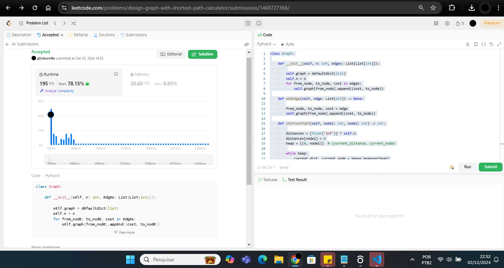
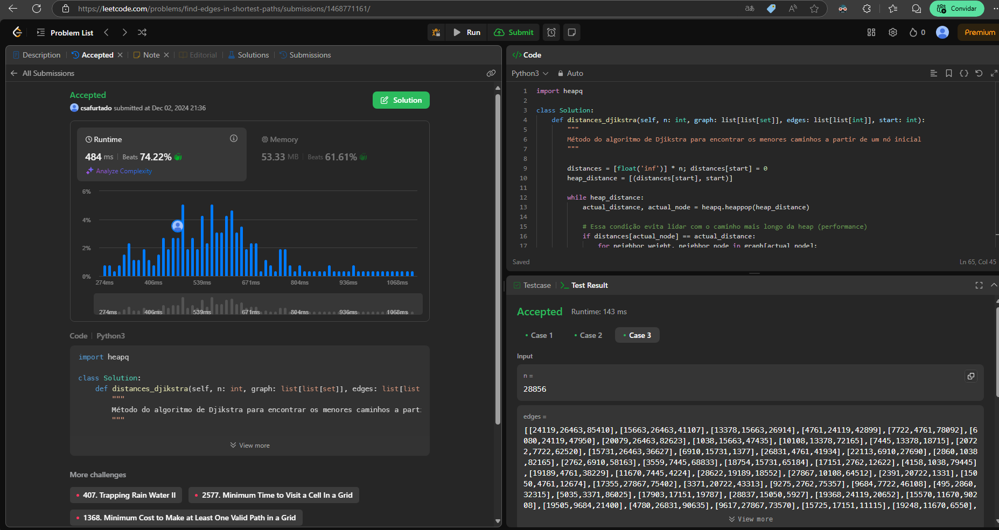

# Exercícios do Juiz Online LeetCode

**Número da Lista**: 49 
**Conteúdo da Disciplina**: Grafos 2 

## Alunos
|Matrícula | Aluno |
| -- | -- |
| 17/0008291  |  Cristian Furtado |
| 21/1041043 |  Juan Pablo |

## Sobre 
Serão realizados 3 exercícios na plataforma no LeetCode que são:

- <a href="https://leetcode.com/problems/find-edges-in-shortest-paths/description/">3123. Encontrar arestas nos caminhos mais curtos (Difícil)</a>
- <a href="https://leetcode.com/problems/keys-and-rooms/description/ ">0841. Chaves e quartos (Médio)</a>
- <a href="https://leetcode.com/problems/design-graph-with-shortest-path-calculator/description/">2642. Gráfico de design com calculadora de caminho mais curto (Difícil)</a>

## Screenshots

## Instalação 
**Linguagem**: Python 3.10.* 

Necessário ter instalado na máquina versão do Python 3.10.* para que sejam executados os exercícios e uma conta no site LeetCode.

## Uso 
Explique como usar seu projeto caso haja algum passo a passo após o comando de execução.

## Outros 
Quaisquer outras informações sobre seu projeto podem ser descritas abaixo.

## Links dos vídeos com explicação
[Exercício 2642](https://drive.google.com/file/d/100YSPCtVADchO4wVIB1Ao9dB1Pp6NVU-/view?usp=sharing)

[Exercício 3123](https://drive.google.com/file/d/1F6YFCWdwAX_m_P_W7MjwwwDOLggUxrvD/view?usp=sharing)

[Exercício 0841](https://drive.google.com/file/d/1u_Cgljy3b10rWWWUF-ucp7TpAmaBjVaR/view?usp=sharing)

